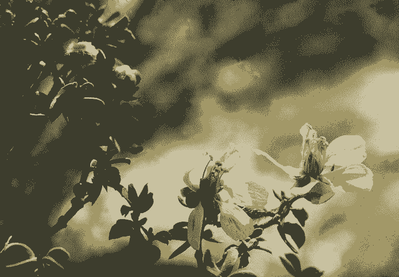
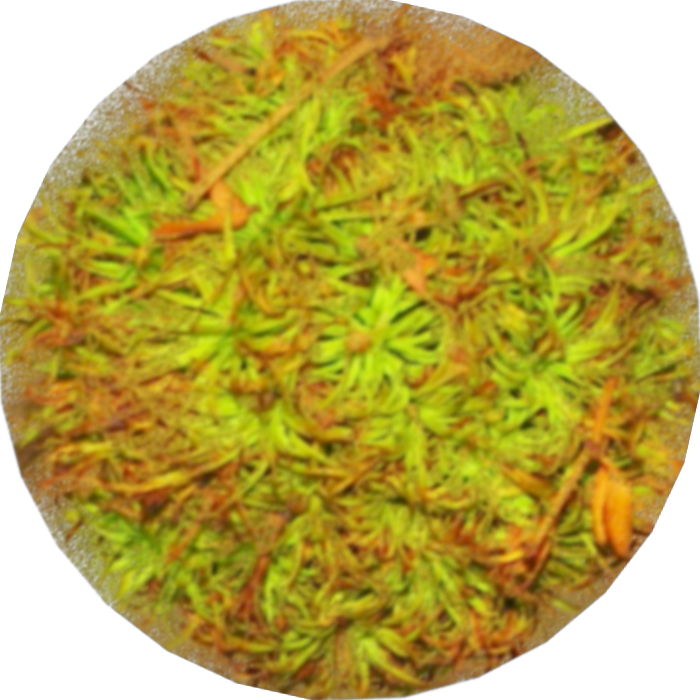

&nbsp;&nbsp;&nbsp;&nbsp;&nbsp;&nbsp;&nbsp;&nbsp;&nbsp;&nbsp;&nbsp;&nbsp;&nbsp;&nbsp;&nbsp;&nbsp;&nbsp;&nbsp;&nbsp;&nbsp;&nbsp;&nbsp;&nbsp;&nbsp;&nbsp;&nbsp;&nbsp;&nbsp;&nbsp;&nbsp;&nbsp;&nbsp;&nbsp;&nbsp;&nbsp;&nbsp;&nbsp;&nbsp;&nbsp;&nbsp;&nbsp;&nbsp;&nbsp;&nbsp;&nbsp;&nbsp;&nbsp;&nbsp;&nbsp;(https://collections.nmnh.si.edu/search/botany/?ark=ark:/65665/30ed120df4fb94c1d8c2c0b06286d0f2a)</img> 
</img></img></img></img> 
**************************************************************************************https://en.wikipedia.org/wiki/Creosote_gall_midge#/media/File:Creosote_gall.JPG</img>

